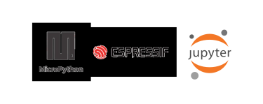

# Boas vindas ao Micropython

<div align="center">
  
</div>

## Introdução

Duas coisas que amo... IoT e programar. Eu sempre gostei de criar projetos de tecnologia, ainda mais com microcontroladores. Esse é um repositório destinado a reservar códigos que podem ser reutilizados para fazer projetos bem legais de IoT ou de apenas de ligar um LED em um circuito alimentado por uma porta USB. 

### As ferramentas principais utilizadas foram:

1. [Micropython](https://micropython.org/)<br>
2. [Python](https://www.python.org/)<br>
3. [Jupyter Notebook](https://jupyter.org/)<br>
4. [ESP8266](https://nodemcu.readthedocs.io/en/release/)<br>
5. [ESP32](https://docs.espressif.com/projects/esp-idf/en/latest/esp32/)<br>
6. [Linux - Ubuntu](https://ubuntu.com/)<br>
---
## Uso do projeto localmente

Antes certifique-se que você tem o Python e Jupyter Notebook instalados. Após cada um dos passos a seguir, haverá um exemplo do comando a ser digitado para fazer o que está sendo pedido, caso tenha dificuldades e o exemplo não seja suficiente, não hesite em me contatar em _eduardawiltiner@gmail.com_.

### Apagando o que está carregando na memoŕia do ESP32/ESP8266 e carregando um novo firmware(FW).

1. Vá para o página [Downloads do MicroPython](http://micropython.org/download#esp8266) e faça o download do FW apropriado para o seu dispositivo utilizado.


2. Abra o terminal e crie um diretório no local de sua preferência com o comando **mkdir**. O ideal é que você tenha uma pasta para trabalhar com micropython:
```javascript
  mkdir my-micropython
```

3. Entre no diretório que acabou de criar:
```javascript
  cd my-micropython
```

4. Conecte o seu dipositivo no computador e verifique onde se encontra a usa porta serial. No meu caso, eu utilizo Linux - Ubuntu. Pode ser diferente para você caso você utilize MAC ou Windows:
```javascript
  ls /dev/ttyUSB*
  // você vai recebber algo do tipo -> /dev/ttyUSBX
```

5. Instale o esptool(vamos utiliza-lo para gravar e apagar FW dos dispositivos):
```javascript
  pip install esptool
```

6. Apague o estiver carregando na memória do seu dispositivo:
```javascript
  esptool.py --port /dev/ttyUSB0 erase_flash
```

7. Agora grave("flash") o novo FW:
```javascript
  esptool.py --port /dev/tty.SLAB_USBtoUART --baud 460800 write_flash --flash_size=detect 0 nome-do-arquivo-que-baixou.9.4.bin
  // o arquivo com bin no passo 1 que você conseguiu
```
### Instalando o kernel micropython para usar o Jupyter Notebook para programar.

1. Você pode utilizar esse tutorial, ele é bem didático e foi o que utilizei para obter o kernel [Micropython Jupyter](https://github.com/goatchurchprime/jupyter_micropython_kernel/). Você pode verificar os Kernels mantidos nessa [Documentação](http://jupyter.org/documentation).


### Clone do repositório

1. Se não já estiver... Entre no diretório que acabou de criar e depois clone o projeto:
```javascript
  cd my-micropython
  git clone https://github.com/dudawiltiner/micropython.git
```

5. Abra no ambiente de desenvolvimento de sua preferência que seja compatível com Python. Eu utilizei o Jupyter Notebook no Linux - Ubuntu, se for o seu caso, abra a pasta no terminal e digite:
```javascript
  jupyter notebook
```
6. Abra a pasta que deseja e rode aplicação. Cada pasta terá imagens, pdfs e arquivos com extensões para python e jupyter. 

## Vídeos listados para Micropython no canal DudaTech

1. [Intalando e criando o seu primeiro Blink com Micropython e ESP8266]('yiu') - PASTA BLINK + CONNECT
